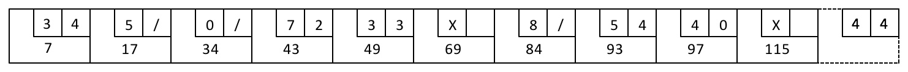
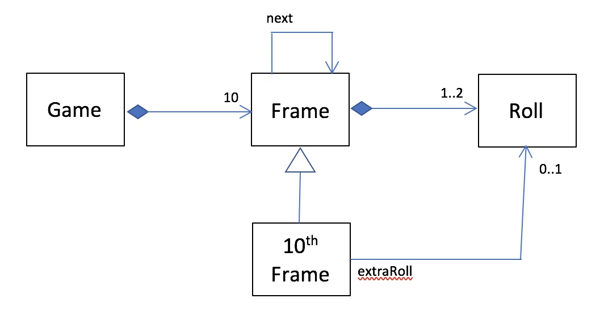

# Bowling Kata
TDD Kata for the game of Bowling

## Bowling Rules

Game consists of 10 frames.

Each frame has 2 rolls except the 10th frame, which may have 3 rolls.

Score for the frame is the number of pins knocked out in two rolls.

If all 10 pins are knocked out in two rolls, it's a spare. Spare frame adds pins of the first roll in the next frame to its score.

If all 10 pins are knocked out on the first roll of a frame, it's called a strike. Strike adds pins of the next two rolls to its score.

If a strike or spare scored on the tenth frame, then an extra roll is added to the frame to keep the score;

## Mental Model

## Rules of TDD
1. Don't write any production code unless it is to make a failing unit test pass.
2. Don't write any more of a unit test than is sufficient to fail; and compilation failures are failures.
3. Don't write any more production code than is sufficient to pass the one failing unit test.

RED: Write a failing test

GREEN: Write production code to fix the test

BLUE: Refactor the test and the production code but never both at the same time.